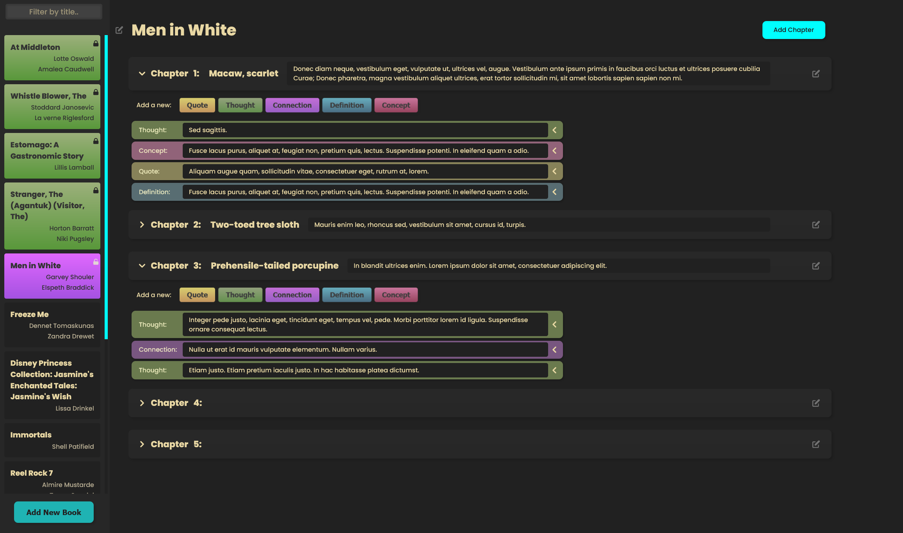

      
    
    <h1>
    Bookwise - a book note management solution
     
    </h1>

  The first module of [Samwise](https://github.com/dChancellor/samwise), the global unitary assistant. This particular module gives Samwise the ability to maintain notes taken while reading a book. No longer will you need to use those little tabs that are too small and fall out. Log it in Bookwise and keep it forever.
  

   <strong>CSS</strong>&nbsp;  &nbsp; &nbsp; <strong>Svelte</strong> &nbsp;  &nbsp; &nbsp;
  

   
  

      
    
    
  

 

## Table of Contents

- [Table of Contents](#table-of-contents)
- [Installation](#installation)
  - [Requirements](#requirements)
- [Features](#features)
- [Upcoming Features](#upcoming-features)
- [FAQ](#faq)
  - [How do I add books?](#how-do-i-add-books)
  - [How do I change the theme?](#how-do-i-change-the-theme)
  - [Can I add new note types or adapt the ones you currently implemented?](#can-i-add-new-note-types-or-adapt-the-ones-you-currently-implemented)
  - [I mostly like what you've done, but I want to tweak a few things. Can I fork this and use it myself?](#i-mostly-like-what-youve-done-but-i-want-to-tweak-a-few-things-can-i-fork-this-and-use-it-myself)
  
## Installation

### Requirements

- Some API, database or some other way to store flat files

  > If you want some detail about how I took care of this issue, you can see the work-in-progress application [Samwise](https://github.com/dChancellor/samwise) that this module plugs into. Eventually these will be married together much more tightly, but for now you just need some way to handle the incoming and outgoing data.

- A static site host
  > You can either self-host the static files or use one of the many CDN/other services that allow you to host these static files. I find that utilizing the global network that these organizations have allows greater speed from anywhere in the world.

## Features

- Fluid design allowing for book customization
- Ability to easily reorder chapters with drag and drop
- 5 different note types with the ability to easily add more
- Easily customizable theme with global CSS variables being inserted from a theme object. Can easily keep these themes in a database per user.
- Keep both the direct quote from the book plus any thoughts you would like to add.
- Can pin books that you are in the process of reading/access often.

## Upcoming Features

- Add page numbers to the note objects
- Allow note linking if notes between chapters or notes between books are related in some way
- Make it easier for forkers to implement their own APIs
- Implement Google Book API access to easily import books
- Allow easier note type refactoring, ensuring the CSS colors are completely reliant on this object so anyone forking this only needs to add a note type to one place with color data and it will flow through the app.
  
## FAQ

### How do I add books?

> Unfortunately as this is not a v1 release yet, adding books has not been implemented in the public version. I am looking to refactor this in a way that allows people to easily implement their own database and API with only a few tweaks to a config file. Because of this, you will need to either manually add books or implement your own version of the "Add Book" modal. Version 1.0 will be coming very soon though!

### How do I change the theme?
> You can easily change the theme by altering `/store/theme.js`. This is a global store which gets added to the main element as CSS variables, allowing them to be used in the entire application.

### Can I add new note types or adapt the ones you currently implemented?
> Yes! There is a `/lib/dictionary.js` file which has an exported object with the note types. Everything relies on this object, so it should be as simple as adding something to this object and then altering the CSS for your custom colors. I am looking to have the CSS rely on this object in the near future so it will just be a one step process, however.

### I mostly like what you've done, but I want to tweak a few things. Can I fork this and use it myself?

> Of course you can! I initially made this tool primarily for myself, but have released it to the wild to help anyone. Take it, change it, morph it and squash it to your heart's desire.
